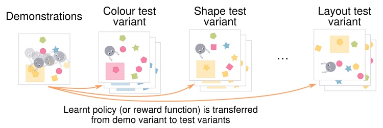
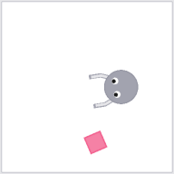
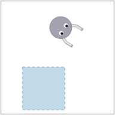
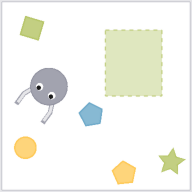
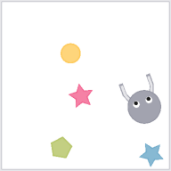
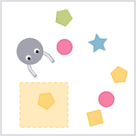
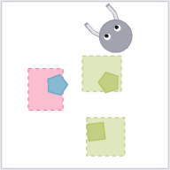
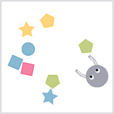
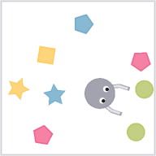

# Multitask Assessment of Generalisation in Imitative Control Algorithms (MAGICAL)

[](https://badge.fury.io/py/magical-il)
[](https://app.circleci.com/pipelines/github/qxcv/magical)
[](https://colab.research.google.com/github/qxcv/magical/blob/pyglet1.5/demo-notebook.ipynb)

## A Benchmark Suite for Robust imitation Learning

MAGICAL is a benchmark suite to evaluate the generalisation capabilities of
imitation learning algorithms. Rather than using the same setting for training
and testing, MAGICAL provides one set of "training" environments where
demonstrations are observed, and another, distinct set of "testing" environments
which each vary in different ways. MAGICAL is a multitask suite, and we refer to
the training environment for a given task as the "demo variant", and the testing
environments for task as "test variants". This structure makes it possible to
evaluate how well an imitation learning (or reward learning) algorithm is able
to generalise the intent behind a set of demonstrations to a substantially
different setting.



The different tasks that comprise the MAGICAL suite each require similar skills,
such as manipulation of 2D blocks, perception of shape and colour, relational
reasoning, and so on. This makes it possible, in principle, to use multi-task
and meta-IL algorithms that allow for transfer of skills between tasks, and
(hopefully) extrapolation of demonstrator intent across the different variants
for each task.

## Installing and using MAGICAL

You can install MAGICAL using `pip`:

```sh
pip install magical-il
```

If you have an X server and input device, you can try controlling the robot in
one of the environments:

```sh
python -m magical --env-name FindDupe-Demo-v0
```

Use the arrow keys to move, space bar to close the grippers, and `R` key to
reset the environment.

At an API level, MAGICAL tasks and variants are just Gym environments. Once
you've installed MAGICAL, you can use the Gym environments as follows:

```python
import gym
import magical

# magical.register_envs() must be called before making any Gym envs
magical.register_envs()

# creating a demo variant for one task
env = gym.make('FindDupe-Demo-v0')
env.reset()
env.render(mode='human')
env.close()

# We can also make the test variant of the same environment, or add a
# preprocessor to the environment. In this case, we are creating a
# TestShape variant of the original environment, and applying the
# LoRes4E preprocessor to observations. LoRes4E stacks four
# egocentric frames together and downsamples them to 96x96.
env = gym.make('FindDupe-TestShape-LoRes4E-v0')
init_obs = env.reset()
print('Observation type:', type(obs))  # np.ndarray
print('Observation shape:', obs.shape)  # (96, 96, 3)
env.close()
```

In general, Gym environment names for MAGICAL take the form
`<task-name>-<variant>[-<preprocessor]-v0`, where the final preprocessor name is
optional. For instance,`FindDupe-Demo-v0`, `MoveToCorner-Demo-LoResStack-v0` and
`ClusterColour-TestAll-v0` are all available Gym environments. Keep reading to
see a list of all available tasks and variants, as well as all the builtin
observation preprocessors that ship with MAGICAL.

Note that the reference demonstration data for MAGICAL is *not* included in the
PyPI package. Rather, it is packaged as [another Github
repository](https://github.com/qxcv/magical-data/). See the "Using pre-recorded
demonstrations" section below for instructions on using this data.

## Tasks and variants

Here are the available tasks, along with a picture of the initial state of the
demo variant:

| | Task |
| :---: | --- |
|  | **MoveToCorner:** Robot must push a block from the bottom right corner to the top left. Does not support Layout and CountPlus variants. |
|  | **MoveToRegion:** Move into the goal region and stay there. Does not support Shape and CountPlus variants. |
|  | **MatchRegions:** Fill the goal region with all blocks of the same colour as the goal region. |
|  | **MakeLine:** Arrange all blocks into a line. |
|  | **FindDupe:** The goal region starts with one block inside it. The robot must find a duplicate of the block, and push it inside the goal region too. |
|  | **FixColour:** There are several goal regions, each containing one block. One goal region has a block which doesn't match the regions colour. That block should be pushed out of its region, while keeping all other colours the same. |
|  | **ClusterColour:** Sort the blocks into spatially separated clusters of uniform colour. |
|  | **ClusterShape:** Sort the blocks into spatially separated clusters of uniform shape. |

Each task can be instantiated in one of several _variants_, each of which
changes one or more aspects of the environment to evaluate combinatorial
generalisation:

- **Demo:** the default variant in which all demonstrations are observed.
  Initial states of the demo variants for each task are pictured above.
- **Jitter:** the rotations and orientations of all objects, and the size of
  goal regions, is jittered by up to 5% of the maximum range.
- **Layout:** positions and rotations of all objects are completely randomised.
- **Colour:** colours of blocks and goal reginos are randomised, subject to
  task-specific constraints (e.g. that there should always be at least one block
  of each colour in ClusterColour).
- **Shape:** shapes of pushable blocks are randomised, again subject to
  task-specific constraints.
- **CountPlus:** the layout, colour, shape, and _number_ of objects is
  randomised.
- **Dynamics:** mass and friction of objects is randomsied.
- **All:** all applicable randomisations are applied.

Except where listsed in the task table above, all tasks support all variants.

## Preprocessors

The default observation type is a `dict` containing two keys, `ego` and `allo`,
corresponding to egocentric and allocentric views of the environment,
respectively. The values of this dictionary are 384×384 RGB images with the the
corresponding view. If you don't want to work with a dict of views for single
time steps, then you can also get observation spaces by appending one of the
following preprocessor names to the env name:

- `-LoResStack`: rather than showing only one image of the environment, values
  of the observation dict will contain the four most recent frames, concatenated
  along the channels axis. Additionally, observations will be resized to 96×96
  pixels.
- `-LoRes4E`: rather than having a dict observation space, observations will now
  be 96×96×12 numpy arrays containing only the four most recent egocentric
  views, stacked along the channels axis.
- `-LoRes4A`: like `-LoRes4E`, but with allocentric views instead of egocentric
  views.
- `-LoRes3EA`: like `-LoRes4E`, but contains the three most recent egocentric
  views concatenated with the most recent allocentric view. Useful for
  maintaining full observability of the workspace while retaining the
  ease-of-learning afforded by an egocentric perspective.
- `LoResCHW4E`: like `-LoRes4E`, but transposes observations to be
  channels-first (i.e. the Torch default).

The complete list of preprocessors is defined in
`magical.benchmarks.DEFAULT_PREPROC_ENTRY_POINT_WRAPPERS`.

## Using pre-recorded demonstrations

We distribute [reference
demonstrations](https://github.com/qxcv/magical-data.git) for use with the
MAGICAL benchmark. To download the demonstrations, use
`magical.reference_demos`:

```python
import magical
magical.try_download_demos(dest="demos")
```

Now the `demos` directory will contain a set of demonstration trajectories as
compressed pickles, like so:

```
demos
├── cluster-colour
│   ├── demo-ClusterColour-Demo-v0-000.pkl.gz
│   ├── demo-ClusterColour-Demo-v0-001.pkl.gz
│   ├── demo-ClusterColour-Demo-v0-002.pkl.gz
│   ├── …
│   └── demo-ClusterColour-Demo-v0-024.pkl.gz
├── cluster-shape
│   ├── demo-ClusterShape-Demo-v0-000.pkl.gz
│   └── …
├── find-dupe
│   ├── demo-FindDupe-Demo-v0-000.pkl.gz
│   └── …
├── fix-colour
│   ├── demo-FixColour-Demo-v0-000.pkl.gz
│   └── …
├── make-line
│   ├── demo-MakeLine-Demo-v0-000.pkl.gz
│   └── …
├── match-regions
│   ├── demo-MatchRegions-Demo-v0-000.pkl.gz
│   └── …
├── move-to-corner
│   ├── demo-MoveToCorner-Demo-v0-000.pkl.gz
│   └── …
├── move-to-region
│   ├── demo-MoveToRegion-Demo-v0-000.pkl.gz
└── └── …
```

To load these files, you can use `magical.load_demos`:

```python
import magical, glob
demo_trajs = list(magical.load_demos(glob.glob("demos/move-to-corner/demo-*.pkl.gz")))
```
